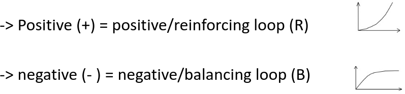
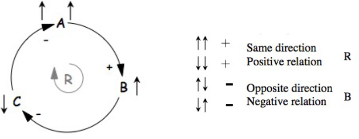

# System
## Characteristics
- Input and Output
- Set of components
- Rules and relationships between components
- System's boundaries

# System's loops
## Feedback loops
Feedback loops are the system's response to changes
Two types of loops:
- Positive feedback loops (Reinforcing):  
  Causes systems to change further in same direction
- Negative feedback loops (Balancing):  
  Causes systems to change in opposite direction from which it is moving

### System's responses
#### Time delays
Complex systems often show time delays between input of a feedback stimulus and the response to it  
Ex: Population growth or global climate change 

#### Synergistic interaction
System effects can be amplified through synergistic interaction

## Casual loop diagram (CLDs)
CLDs are maps showing casual links with arrows from a cause to an effect and it allows the identification of polarity of feedback loops (positive or negative)

## Reference Behavior Pattern (RBP)

#### Example

If A increases, B will increase (↑↑)
- Arrows show same direction → assign (-)
- Variables can also be decreasing in the same direction (↓↓) → also  assign (-)

If B increases, C decreases (↑↓)
- Arrows show opposite directions → assign (-)

If C decreases, A increases (↓↑)
- Arrows show opposite direcions → assign (-)

So:
A↑ → B↑ → C↓ → A↑↑ (Reinforcing Loop)
A↓ → B↓ → C↑ → A↓↓ (Reinforcing Loop)